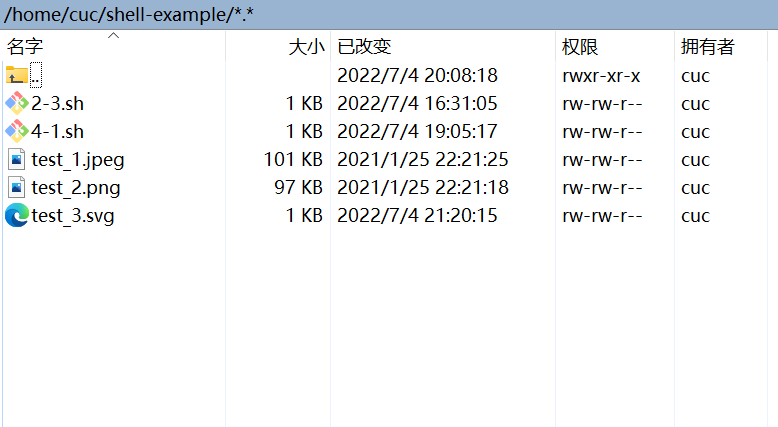
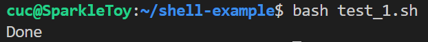
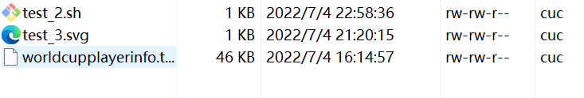
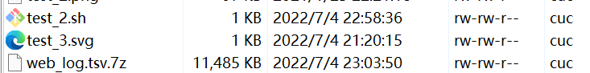

# 任务要求完成情况

### 任务一

√ 支持对jpeg格式图片进行图片质量压缩

√ 支持对jpeg/png/svg格式图片在保持原始宽高比的前提下压缩分辨率

√ 支持对图片批量添加自定义文本水印

√ 支持批量重命名（统一添加文件名前缀或后缀，不影响原始文件扩展名）

√ 支持将png/svg图片统一转换为jpg格式图片

### 任务二

##### 2014世界杯运动员数据

√ 统计不同年龄区间范围（20岁以下、[20-30]、30岁以上）的球员数量、百分比

√ 统计不同场上位置的球员数量、百分比

√ 名字最长的球员是谁？名字最短的球员是谁？

√ 年龄最大的球员是谁？年龄最小的球员是谁？

##### Web服务器访问日志

统计访问来源主机TOP 100和分别对应出现的总次数

统计访问来源主机TOP 100 IP和分别对应出现的总次数

统计最频繁被访问的URL TOP 100

统计不同响应状态码的出现次数和对应百分比

分别统计不同4XX状态码对应的TOP 10 URL和对应出现的总次数

给定URL输出TOP 100访问来源主机

# 实验过程

### 任务一：用bash编写一个图片批处理脚本，实现以下功能：

1.安装imagemagick和shellcheck。

    sudo apt install shellcheck

    sudo apt install imagemagick

2.用scp上传图片文件

3.对jpeg格式图片进行图片质量压缩

    #!/usr/bin
    #对jpeg格式图片进行图片质量压缩

    for file in  `find ./ -name "*.jpeg"`;
    do 
      if [ `stat --printf="%s" $file` -gt 1000000 ]
      then
        echo $file
        mogrify -resize 50% $file
      fi
    done

    echo "Done"

结果：

4.支持对jpeg/png/svg格式图片在保持原始宽高比的前提下压缩分辨率

    for file in `find ./ -name "*.jpeg"`; do
      to_middle_file="${file%.*}_m.${file##*.}"; //文件名加后缀 如 hello_m.jpg
      to_small_file="${file%.*}_s.${file##*.}";
      convert ${img} -resize 300x180! ${to_middle_file};
      ls ${to_middle_file};
      convert ${img} -resize 100x60! ${to_small_file};
      ls ${to_small_file};
    done

    echo "test2 Done"

5.支持对图片批量添加自定义文本水印

    function textmark{
    for i in *;do
        type=${i##*.}
        if [[ ${type} != "jpeg" && ${type} != "png" && ${type} != "svg" ]]; then continue; fi;
        convert "${i}" -pointsize "$1" -fill black -gravity center -draw "text 10,10 '$2'" "${i}"
        echo "${i} is watermarked with $2."
    done

    echo "test3 Done"
    }

6.支持批量重命名（统一添加文件名前缀或后缀，不影响原始文件扩展名）

    #前缀
    function prefix {
      for i in *;do
        type=${i##*.}
        if [[ ${type} != "jpeg" && ${type} != "png" && ${type} != "svg" ]]; then continue; fi;
        mv "${i}" "$1""${i}"
        echo "test3-1 done"
      done
    }

    # 后缀
    function postfix {
      for i in *;do
        type=${i##*.}
        if [[ ${type} != "jpeg" && ${type} != "png" && ${type} != "svg" ]]; then continue; fi;
        filename=${i%.*}$1"."${type}
        mv "${i}" "${filename}"
        echo "test3-2 done"
      done
    }

7.支持将png/svg图片统一转换为jpg格式图片

    function transform{
    for i in *;do
        type=${i##*.}
        if [[ ${type} != "png" && ${type} != "svg" ]]; then continue; fi;
        filename=${i%.*}".jpg"
        convert "${i}" "${filename}"
   	echo "test4 done"
    done
    }

### 任务二：用bash编写一个文本批处理脚本，对以下附件分别进行批量处理完成相应的数据统计任务

##### 2014世界杯运动员数据

scp上传数据

#统计不同年龄区间范围（20岁以下、[20-30]、30岁以上）的球员数量、百分比
    function player_Age {
      awk -F "\t" 
        BEGIN {a=0; b=0; c=0;}
        $6!="Age" {
            if($6>=0&&$6<20) {a++;}
            else if($6<=30) {b++;}
            else {c++;}
        }
        END {
            sum=a+b+c;
            printf("Age\tCount\tPercentage\n");
            printf("<20\t%d\t%f%%\n",a,a*100.0/sum);
            printf("[20,30]\t%d\t%f%%\n",b,b*100.0/sum);
            printf(">30\t%d\t%f%%\n",c,c*100.0/sum);
        }worldcupplayerinfo.tsv
    }

#统计不同场上位置的球员数量、百分比
    function player_position {
      awk -F "\t" 
        BEGIN {sum=0}
        $5!="Position" {
            pos[$5]++;
            sum++;
        }
        END {
            printf("    Position\tCount\tPercentage\n");
            for(i in pos) {
                printf("%13s\t%d\t%f%%\n",i,pos[i],pos[i]*100.0/sum);
            }
        }worldcupplayerinfo.tsv
    }

#名字最长/最短的球员
    function max_min_Name {
      awk -F "\t" 
        BEGIN {max=-1; min=1000;}
        $9!="Player" {
            len=length($9);
            names[$9]=len;
            max=len>max?len:max;
            min=len<min?len:min;
        }
        END {
            for(i in names) {
                if(names[i]==max) {
                    printf("The longest : %s\n", i);
                } else  if(names[i]==min) {
                    printf("The shortest : s\n", i);
                }
            }
        }worldcupplayerinfo.tsv
    }

#年龄最大/最小球员
    function max_min_Age {
      awk -F "\t" '
        BEGIN {max=-1; min=1000;}
        NR>1 {
            age=$6;
            names[$9]=age;
            max=age>max?age:max;
            min=age<min?age:min;
        }
        END {
            printf("The oldest age is %d, who is\n", max);
            for(i in names) {
                if(names[i]==max) { printf("%s\n", i); }
            }
            printf("The youngest age is %d, who is\n", min);
            for(i in names) {
                if(names[i]==min) { printf("%s\n", i); }
            }
        }' worldcupplayerinfo.tsv
    }

##### Web服务器访问日志

scp上传数据

# 参考

https://www.likecs.com/show-203436370.html

https://blog.51cto.com/u_15127519/4620660

https://blog.csdn.net/hax960804/article/details/85779598?ops_request_misc=%257B%2522request%255Fid%2522%253A%2522165694252616781683970777%2522%252C%2522scm%2522%253A%252220140713.130102334..%2522%257D&request_id=165694252616781683970777&biz_id=0&utm_medium=distribute.pc_search_result.none-task-blog-2~all~sobaiduend~default-2-85779598-null-null.142^v30^control,185^v2^control&utm_term=bash%E8%84%9A%E6%9C%AC&spm=1018.2226.3001.4187

https://blog.csdn.net/weixin_40805392/article/details/104792874