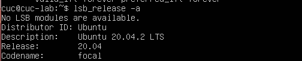
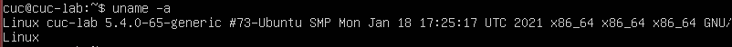
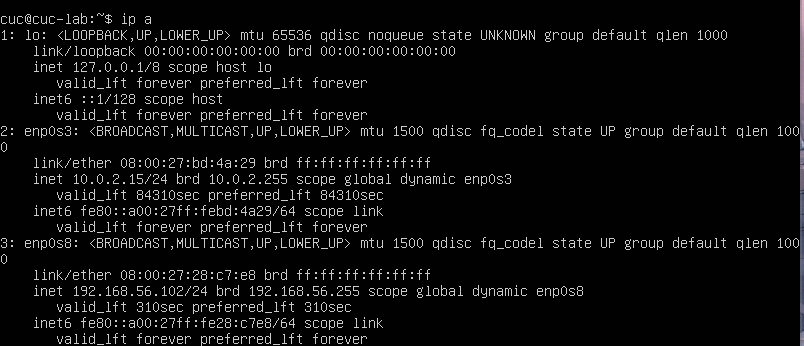
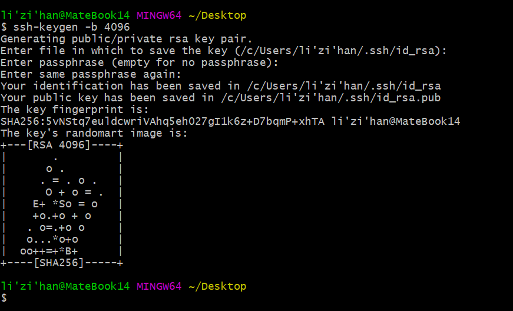
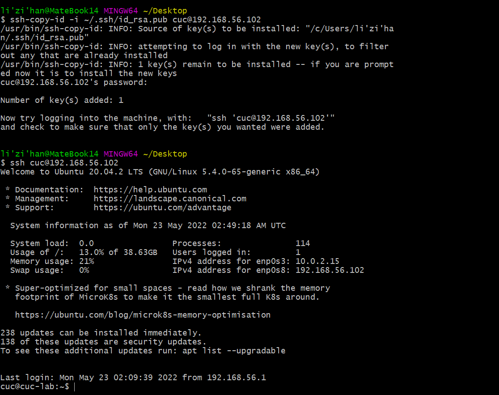

## 1.调查并记录实验环境的如下信息：

### 当前 Linux 发行版基本信息

### 当前 Linux 内核版本信息

## 2.Virtualbox 安装完 Ubuntu 之后新添加的网卡如何实现系统开机自动启用和自动获取 IP？

查看当前网卡：

## 3.如何使用 scp 在「虚拟机和宿主机之间」、「本机和远程 Linux 系统之间」传输文件？

##### 虚拟机和宿主机之间

上传文件：

    scp -p port source_dictionary_file user@ServerIp:target_dictionary_file

下载文件：  

    scp -p user@ServerIp:source_dictionary_file target_dictionary

##### 本机和远程 Linux 系统之间

从本机复制到远程Linux系统：

    scp local_file remote_username@remote_ip:remote_folder

从远程Linux系统复制到本机：

    scp remote_ip:remote_folder@local_file remote_username

## 4.如何配置 SSH 免密登录？

生成SSH密钥对：打开gitbash，输入命令
    
    ssh-keygen -b 4096

将SSH密钥复制到远程Linux设备，输入命令：

    ssh-copy-id -i ~/.ssh/id_rsa.pub cuc@192.168.56.102

已完成SSH免密登录，尝试是否成功，输入命令：

    ssh cuc@192.168.56.102

免密登录成功

## 参阅

https://www.csdn.net/tags/MtTaUg4sNTgyODktYmxvZwO0O0OO0O0O.html

https://blog.csdn.net/sd4015700/article/details/24868571